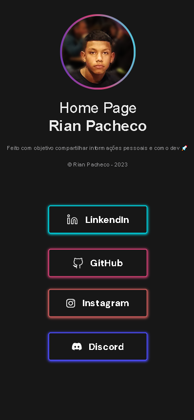
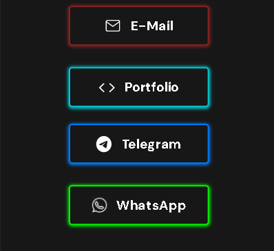
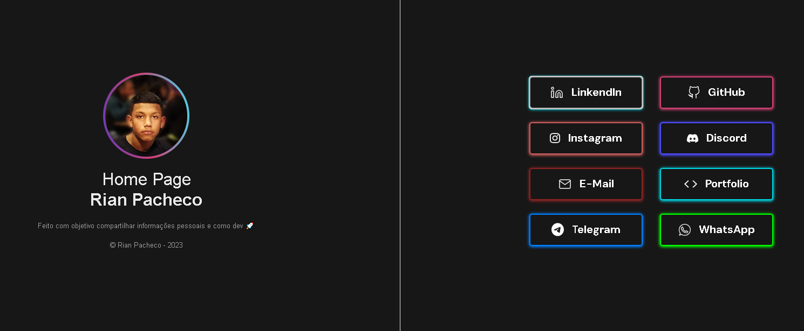

# Minha-HomePage &copy; Rian Pacheco 🚀💯
# Home Page
 

# Sobre o projeto

https://rianpacheco.netlify.com

Home Page é um projeto web construída durante uma curiosidade de como era desenvolver com o Front-End...

A aplicação consiste em uma pagina para as pessoas ter acesso as minhas redes socias..

## Layout mobile
 

## Layout web

# Tecnologias utilizadas 💻 :

## 🔅 Front end
- HTML
- CSS
- JS

## ✔ Implantação em produção 
- Front end web: Netlify

# © Autor

&copy; <a href="https://www.linkedin.com/in/rian-pacheco/"> Rian Pacheco</a>

